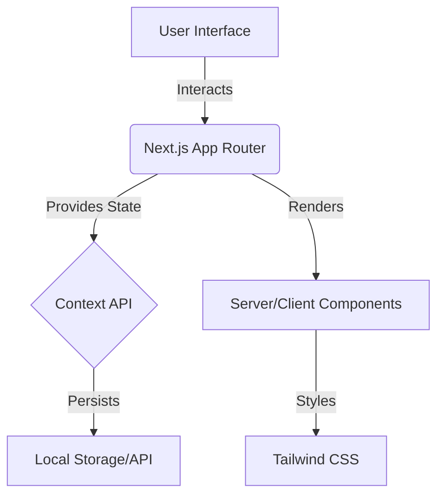

# 📖 SaveBook

> **Empowering your thoughts with a seamless, distraction-free note-taking experience.**

SaveBook is a high-performance, modern web application designed for note-taking and knowledge management. Built leveraging the latest **Next.js** features, it provides a fast, intuitive, and clutter-free environment for organizing your digital life.

---

## 🏗️ Architecture & Data Flow

Understanding how **SaveBook** handles data is key for contributors. Here is the high-level architecture of the application:



---

## 🚀 Quick Start (TL;DR)

Get up and running in less than **2 minutes**:

1. **Clone & Enter**
```bash
git clone [https://github.com/HarshYadav152/SaveBook.git](https://github.com/HarshYadav152/SaveBook.git) && cd SaveBook/savebook
```
   
2. **Install Dependencies**
```bash
npm install
```

3. **Run Development Server**
```
npm run dev
```

> [!TIP]
> Once the server starts, open [http://localhost:3000](http://localhost:3000) in your browser to see the app in action!

---

## 📁 Project Structure

> [!NOTE]
> The core application logic resides within the `savebook/` subdirectory.

```text
SaveBook/
├── .github/              # Issue & PR Templates
├── savebook/             # <--- MAIN APPLICATION
│   ├── app/              # Routes & Pages (Next.js App Router)
│   ├── components/       # UI Components (Buttons, Cards, etc.)
│   ├── context/          # State Management
│   ├── lib/              # Utility & Helper Functions
│   └── public/           # Static Assets
├── CONTRIBUTING.md       # Contribution Guide
└── LICENSE               # MIT License
```

---

## ✨ Features

* 🎨 **Modern UI** – Clean and intuitive design focused on reducing distraction.
* 📂 **Smart Organization** – Efficient tools for creating, editing, and managing your digital knowledge base.
* ⚡ **High Performance** – Optimized with Next.js for near-instant load times and smooth transitions.
* 📱 **Fully Responsive** – A seamless, native-like experience across mobile, tablet, and desktop devices.

---

## 🤝 Contributing to ECWoC 2026

> [!IMPORTANT]
> We are proud to be part of **ECWoC 2026**! We welcome contributors of all skill levels to help shape the future of SaveBook.

1.  🔍 **Find an Issue**: Check our [Issues](https://github.com/HarshYadav152/SaveBook/issues) page for "good first issues."
2.  📖 **Guidelines**: Read our [Contributing Guidelines](CONTRIBUTING.md) to understand our workflow.
3.  🚀 **Submit**: Fork the repo, make your changes, and open a Pull Request!

---

## 👥 Meet the Team

| Role | Name | GitHub |
| :--- | :--- | :--- |
| **Project Mentor** | Harsh Yadav | [@harshyadav152](https://github.com/harshyadav152) |
| **Project Admin** | Vinay Kumar | [@vinayboss9669](https://github.com/vinayboss9669) |

---

## 🌟 Show Your Support

Give a ⭐️ if this project helped you! Your support means a lot to the maintainers and the **ECWoC** community.

**Built with ❤️ by the [SaveBook Community](https://github.com/HarshYadav152/SaveBook/graphs/contributors)**
